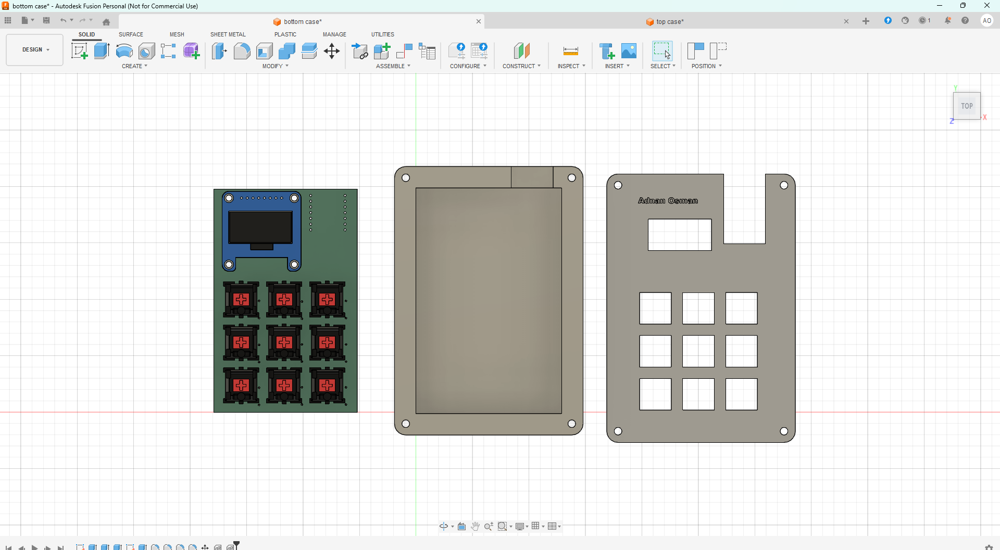
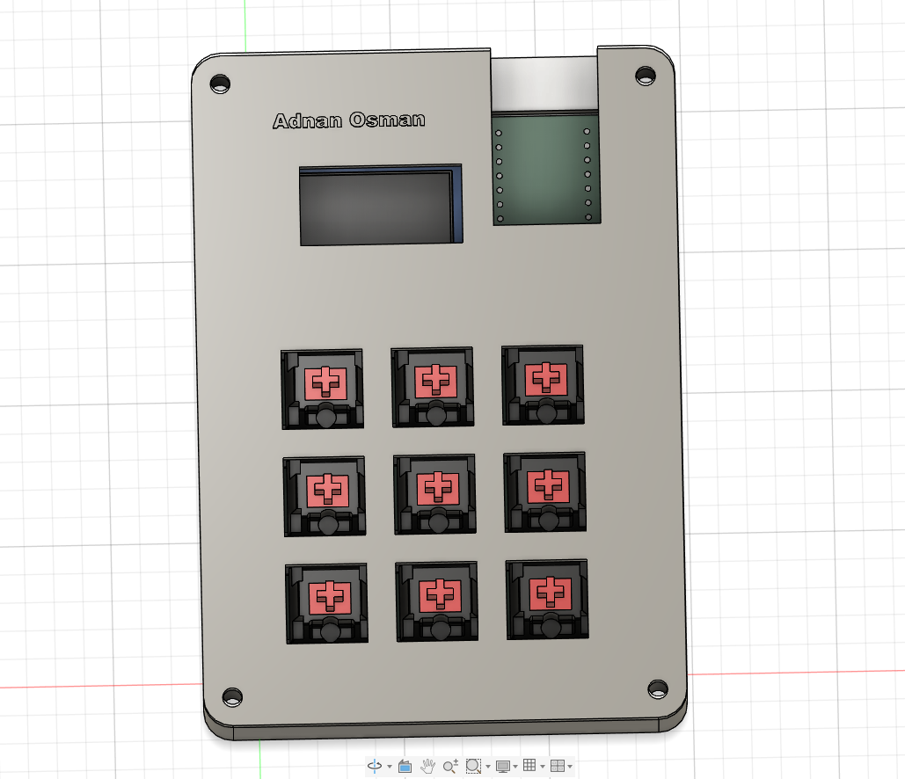

<h1 align="center">
  Adnan's 3x3 Macro-Pad
   
</h1>

<h4 align="center">
A custom mechanical macro-pad with OLED screen
</h4>

## Key Features

- **Seeed Studio XIAO RP2040** microcontroller
- **KMK Firmware** - CircuitPython
- **OLED Display** - SSD1306 (128×64)
- **3×3 Key Matrix** with diode orientation

## Design

Designed in KiCad and Fusion 360 for PCB and Case

### PCB

Designed in KiCad

**Schematic:**

**PCB :**

**PCB 3D view**

### Case

Designed in Fusion 360 (This was my first time on CAD)

**Case Assembly:**

**Case Top:**

**Case Bottom:**

### Final Build

## Bill of Materials

| Component | Item | Qty | Link |
|-----------|------|-----|------|
| Controller | Seeed Studio XIAO RP2040 | 1 | [shop](https://www.aliexpress.com/item/1005003901735765.html?spm=a2g0o.productlist.main.7.476e353djlSDuL&algo_pvid=dbcfa9cd-6189-4b1b-ac88-34a1d319951b&algo_exp_id=dbcfa9cd-6189-4b1b-ac88-34a1d319951b-6&pdp_ext_f=%7B%22order%22%3A%2210%22%2C%22eval%22%3A%221%22%2C%22fromPage%22%3A%22search%22%7D&pdp_npi=6%40dis%21BDT%211235.41%21791.05%21%21%2110.12%216.48%21%402102f0c917702803339762337e94ef%2112000027424449312%21sea%21BD%210%21ABX%211%210%21n_tag%3A-29910%3Bd%3A72dc75d0%3Bm03_new_user%3A-29895&curPageLogUid=IyM167uC5ZPL&utparam-url=scene%3Asearch%7Cquery_from%3A%7Cx_object_id%3A1005003901735765%7C_p_origin_prod%3A) |
| Switches | MX-Style - Cherry | 9 | [shop](https://www.aliexpress.com/item/1005008656717678.html) |
| Display | 0.96" SSD1306 OLED | 1 | [shop](https://www.aliexpress.com/item/1005008754404998.html) |
| Diodes | 1N4148 | 9 | [shop](https://store.roboticsbd.com/components/1355-1n4148-diode-robotics-bangladesh.html) |
| Keycaps | Blank DSA Keycaps | 9 | [shop](https://www.aliexpress.com/item/1005006114411137.html?spm=a2g0o.productlist.main.12.7d32mlommlomdd&algo_pvid=3c273ca4-5055-4746-8f86-ce160f57a176&algo_exp_id=3c273ca4-5055-4746-8f86-ce160f57a176-11&pdp_ext_f=%7B%22order%22%3A%22398%22%2C%22eval%22%3A%221%22%2C%22fromPage%22%3A%22search%22%7D&pdp_npi=6%40dis%21BDT%21922.01%21677.86%21%21%2152.16%2138.35%21%402102f22c17702802712277164e2399%2112000035814143793%21sea%21BD%210%21ABX%211%210%21n_tag%3A-29910%3Bd%3A72dc75d0%3Bm03_new_user%3A-29895%3BpisId%3A5000000197858384&curPageLogUid=FdgYhFJXMlbC&utparam-url=scene%3Asearch%7Cquery_from%3A%7Cx_object_id%3A1005006114411137%7C_p_origin_prod%3A) |

* Full URLs and details are here [BOM.csv](BOM.csv)*

## Credits

This project uses:

- [KiCad](https://www.kicad.org/) for PCB design
- [Autodesk Fusion 360](https://www.autodesk.com/products/fusion-360/) for case design
- [KMK Firmware](https://github.com/KMKfw/kmk_firmware) for keyboard functionality
- [Hack Club Blueprint](https://blueprint.hackclub.com/) as guide and inspiration

## License

MIT

---

> GitHub [@Adnanosman](https://github.com/Adnanosman9)
