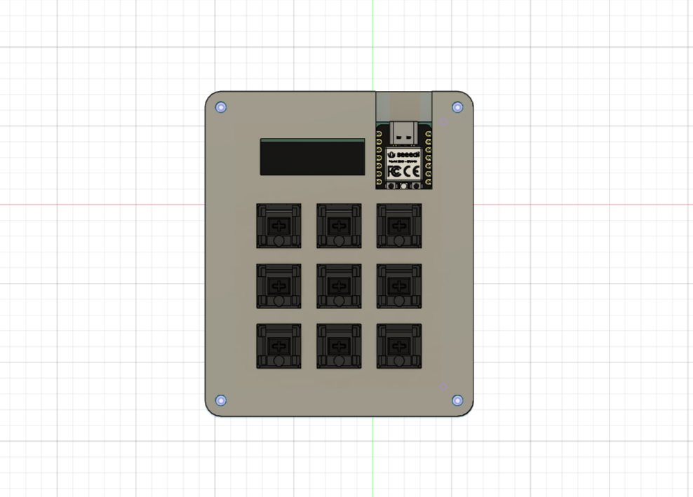

<h1 align="center">
  TriXpad
</h1>

<h4 align="center">
  A custom, open-source mechanical macro-pad featuring an OLED screen.
</h4>

  
  
  

 

##  Key Features

* **Brain:** Powered by the compact and capable **Seeed Studio XIAO RP2040**.
* **Firmware:** Runs on **KMK Firmware** (CircuitPython) for incredibly easy keymap customization without needing to recompile.
* **Display:** Integrated **0.91" SSD1306 OLED (128×64)** for real-time layer feedback, stats, or custom graphics.
* **Matrix:** A clean **3×3 Key Matrix** layout complete with diode orientation for robust anti-ghosting.

---

## Hardware Design

This project was built entirely from scratch, bridging custom PCB design with 3D modeling. 

### PCB (KiCad)
The board was routed and designed in KiCad to keep the footprint as minimal as possible while accommodating the XIAO RP2040 and OLED screen.

| Schematic | PCB Layout | 3D Render |
| :---: | :---: | :---: |
|  |  |  |

### Case (Fusion 360)
The enclosure was designed in Autodesk Fusion 360—marking my very first time diving into CAD! It features a sleek, two-part snap-fit/screw design to house the PCB and switches securely.

| Top Case | Bottom Case |
| :---: | :---: |
|  |  |

###  The Final Build

  

---

##  Bill of Materials (BOM)

Everything you need to build this macro-pad yourself. *(For full details, see the [`BOM.csv`](BOM.csv) file).*

| Component | Description / Item | Qty | Source |
| :--- | :--- | :---: | :--- |
| **Controller** | Seeed Studio XIAO RP2040 | 1 | [AliExpress](https://www.aliexpress.com/item/1005003901735765.html) |
| **Switches** | MX-Style (Cherry) | 9 | [AliExpress](https://www.aliexpress.com/item/1005008656717678.html) |
| **Display** | 0.91" SSD1306 OLED | 1 | [AliExpress](https://www.aliexpress.com/item/1005009334190029.html) |
| **Diodes** | 1N4148 Through-Hole | 9 | [Robotics BD](https://store.roboticsbd.com/components/1355-1n4148-diode-robotics-bangladesh.html) |
| **Keycaps** | Blank DSA Keycaps (Black) | 9 | [AliExpress](https://www.aliexpress.com/item/1005006114411137.html) |

---

##  Credits & Acknowledgments

This project wouldn't be possible without these incredible open-source tools and communities:

* **[KiCad](https://www.kicad.org/)** for the phenomenal open-source PCB design suite.
* **[Autodesk Fusion 360](https://www.autodesk.com/products/fusion-360/)** for the case design environment.
* **[Hack Club Blueprint](https://blueprint.hackclub.com/)** for the guide and inspiration. 
* Massive thanks to **Hack Club Bank** for the grant that funded the PCB and case manufacturing to bring this hardware to life!

 

  
    
  <b>Designed by <a href="https://github.com/Adnanosman9">@Adnanosman</a></b>

